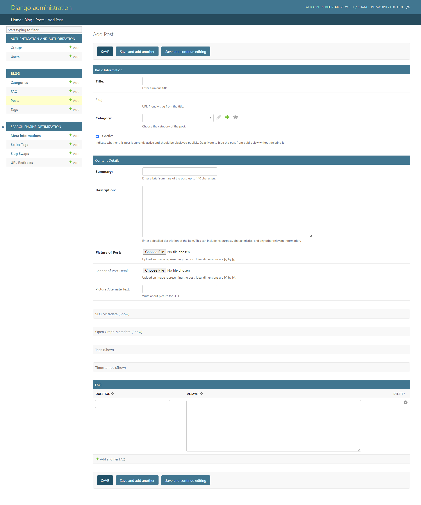
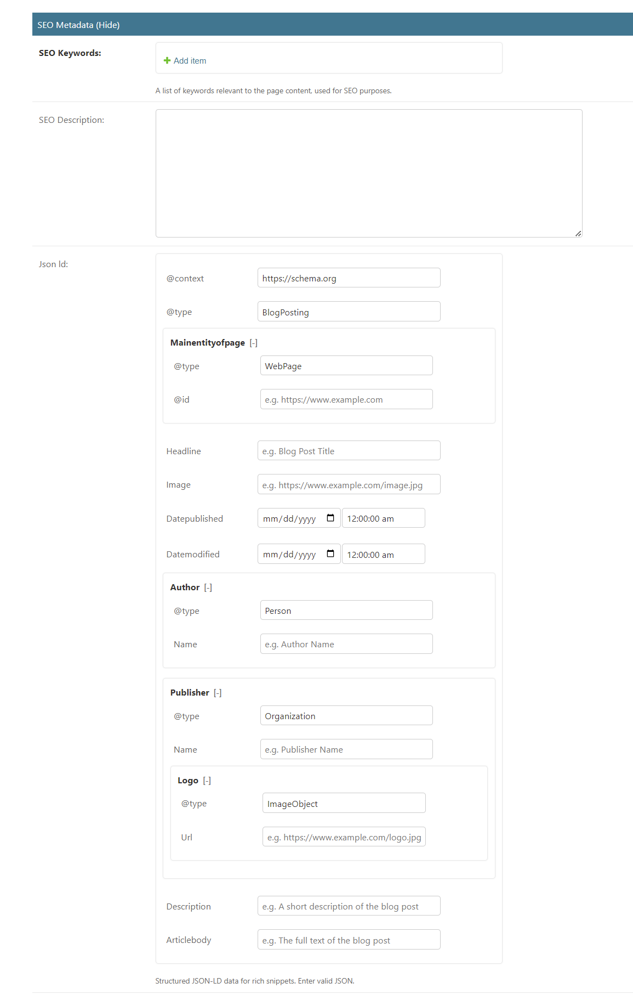
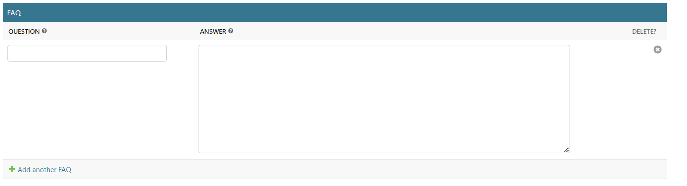

Admin Demo
==========

This document describes the admin features of the `django-sage-blog` package.

SEO Metadata
------------

The SEO Metadata section allows you to add keywords and descriptions for SEO purposes.

In this section, you can add SEO keywords, descriptions, and structured JSON-LD data for rich snippets.

.. note::

   **Fields in SEO Metadata:**
   
   - **SEO Keywords**: A list of keywords relevant to the page content.
   - **SEO Description**: A brief description of the page content.
   - **JSON-LD**: Structured data for search engines.

Add Post
--------

The Add Post section is where you create and manage blog posts.

In this section, you can fill in the post's title, slug, category, summary, and detailed description.

.. note::

   **Fields in Add Post:**

   - **Title**: The unique title of the post.
   - **Slug**: A URL-friendly slug derived from the title.
   - **Category**: The category to which the post belongs.
   - **Summary**: A brief summary of the post (up to 140 characters).
   - **Description**: A detailed description of the post.

.. note::

   **Additional Options:**

   - **Picture of Post**: Upload an image representing the post.
   - **Banner of Post**: Upload a banner image for the post details.
   - **Picture Alternate Text**: SEO text for the image.
   - **SEO Metadata**: Add SEO keywords and descriptions.
   - **Open Graph Metadata**: Add Open Graph data for social media.
   - **Tags**: Add relevant tags for the post.
   - **Timestamps**: View and manage the post's timestamps.

FAQ Section
-----------

At the bottom of the Add Post section, you can add frequently asked questions related to the post.

Each FAQ consists of a question and an answer. You can add multiple FAQs to provide more information to the readers.

.. note::

   **Fields in FAQ Section:**

   - **Question**: The FAQ question.
   - **Answer**: The answer to the FAQ question.

Summary of Features
-------------------

The following table summarizes the key features available in the Django Sage Blog admin interface:

+-----------------------+---------------------------------------------------------------+
| **Feature**           | **Description**                                               |
+=======================+===============================================================+
| **SEO Metadata**      | Add keywords and descriptions for SEO purposes.               |
+-----------------------+---------------------------------------------------------------+
| **Add Post**          | Create and manage blog posts with detailed descriptions.      |
+-----------------------+---------------------------------------------------------------+
| **Picture of Post**   | Upload an image to represent the post.                        |
+-----------------------+---------------------------------------------------------------+
| **Banner of Post**    | Upload a banner image for the post details.                   |
+-----------------------+---------------------------------------------------------------+
| **Picture Alt Text**  | Provide SEO text for images.                                  |
+-----------------------+---------------------------------------------------------------+
| **SEO Metadata**      | Add keywords and descriptions specific to the post.           |
+-----------------------+---------------------------------------------------------------+
| **Open Graph Metadata** | Add Open Graph data for social media sharing.               |
+-----------------------+---------------------------------------------------------------+
| **Tags**              | Add relevant tags to categorize the post.                     |
+-----------------------+---------------------------------------------------------------+
| **Timestamps**        | View and manage timestamps of the post creation and updates.  |
+-----------------------+---------------------------------------------------------------+
| **FAQ Section**       | Add and manage FAQs related to the post.                      |
+-----------------------+---------------------------------------------------------------+
